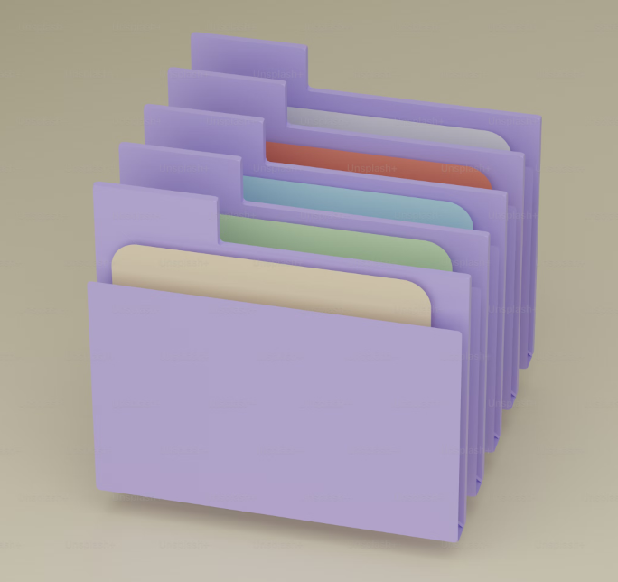
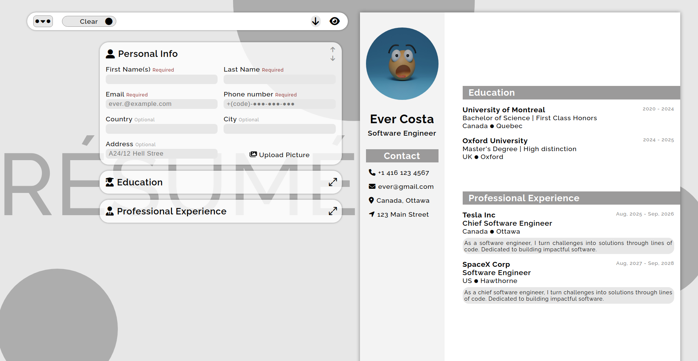
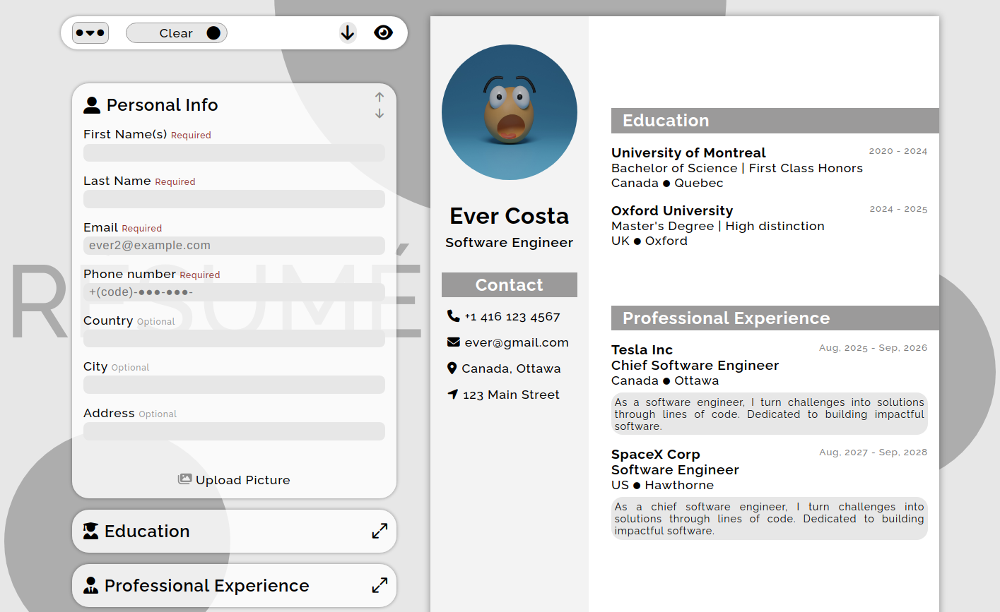
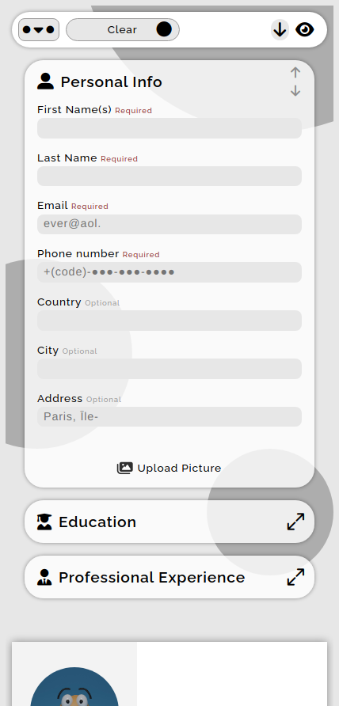

<div align='center'>

# Resume Application

</div>
<div align='center'>
    <h3>💻 Languages</h3>
    
    
    
    <h3>🔧 Technologies</h3>
    
    
    
    
    
    
    
    
    
    
    
    
    
    <h4><a href="https://resume-nu-lake.vercel.app/">Live Preview</a></h4>
</div>

**Demo:**




<details>

**<summary>Screen views</summary>**

**Desktop View:**


<br>

**Tablet View:**


<br>

**Mobile View:**



</details>

## 🌐 Origin

[The Odin Project](https://www.theodinproject.com/)

## 📝 Description

First react project that builds interactive Resume web app.

<details>
<summary>Features</summary>

- Change of palette and Resume layout in Personalization menu.
- A bar to clear Resume or reveal a sample.
- Download Resume
- Hide Resume to get larger Interface to Input.
- Real-time feedback of what input is expected (from animated placeholders)
- Two input fields for respective sections (Education & Profession). More than two can disrupt Resume UI, so it's intentional.
- Icons that are still visible in dark mode.
- Appealing UI

</details>

## 🎯 Relevance

To solidify concepts of `React Fundamentals` in JavaScript.

## 👥 Intended Audience

Developers, users, recruiters.

> [!NOTE]
> Users can install all dependencies using `package.json` file via:
>
> ```bash
> npm install
> ```

## 📂 Files

<details>
<summary>Invert</summary>

| File                                 | Description                                                                                                   |
| ------------------------------------ | ------------------------------------------------------------------------------------------------------------- |
| `src/*`                              | Source files that are bundled into the output directory `dist/`.                                              |
| `src/index.jsx`                      | The main JavaScript entry point that bundling begins.                                                         |
| `src/App.jsx`                        | Main component where overall structure and other layout components of the app are contained.                  |
| `src/assets/*`                       | All assets(imgs, icons, vids) used in website.                                                                |
| `src/components/animateText.js`      | Animates placeholders, required and optional status.                                                          |
| `src/components/getNodes.js`         | Selects nodes from DOM.                                                                                       |
| `src/components/sample.js`           | Updates Resume when cleared or revealed in Navigation.                                                        |
| `src/components/nav.js`              | Responsible for every logic in Nav, including dialog.                                                         |
| `src/components/responsiveTyping.js` | Adds real-time update of Resume from inputs.                                                                  |
| `src/components/inputFields.js`      | Responsible for every logic in input fields.                                                                  |
| `src/styles/App.css`                 | Main stylesheet for entire website.                                                                           |
| `dist/*`                             | Output files from bundling of files in directory `src/`.                                                      |
| `dist/main.js`                       | Main JavaScript output file that contains the bundled JavaScript code, minified and optimized for deployment. |
| `package*`                           | Contains details of project and dependencies versions.                                                        |
| `algorithm.txt`                      | Algorithm for `JavaScript`.                                                                                   |
| `readme-assets/*`                    | Live demo and different screen views used in `README.md`.                                                     |

</details>

## ©️ Credit

<details>
<summary>Invert</summary>

| File                     | Description                                                          |
| ------------------------ | -------------------------------------------------------------------- |
| `src/assets/profile.jpg` | Photo created by Shubham Dhage on [Unsplash](https://unsplash.com/). |
| `src/assets/unknown.jpg` | Photo created by Stephan Müller on [Pexels](https://pexels.com/).    |

</details>

## 🔄 Improvements

<details>
<summary>Invert</summary>

- [ ] Uncomment Skills html, add its input, animated placeholder and make it responsive in Resume.
- [ ] Make download occur once at click.
- [ ] Downloaded Resume should be visibly the same as on website.
- [ ] Add languages.
- [ ] Add night mode.
- [ ] Add real time feedback when user is typing.
- [ ] Add audio in Nav to read Resume.
- [ ] Use correct date input formats (Year for Education, Month-Year for Profession).
- [ ] Transition input fields section smoothly when Resume is hidden.
- [ ] Transition layouts smoothly.
- [ ] Add top-align to Layout in Personalization and make Layout a slider.
- [ ] Make nav sticky
- [ ] Fix inconsistency in placeholder animation cause when tab is changed. (Can restart animation whenever focus on the site changed. Focus also shifts when download button is pressed in phone.)

</details>

## 👤 Curator

1. [Abraham Da Costa Silvanus](https://github.com/asdacosta)

<br>

> [!IMPORTANT]
> Seek contributor's consent for any code usage.

**[🞁 Top](#template)**
