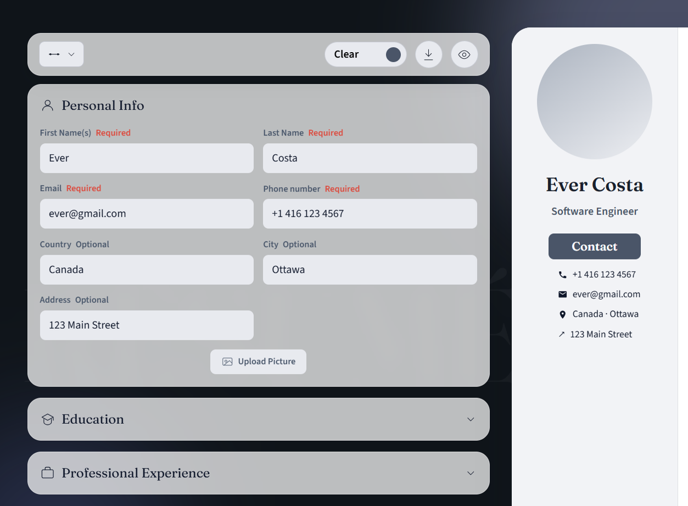
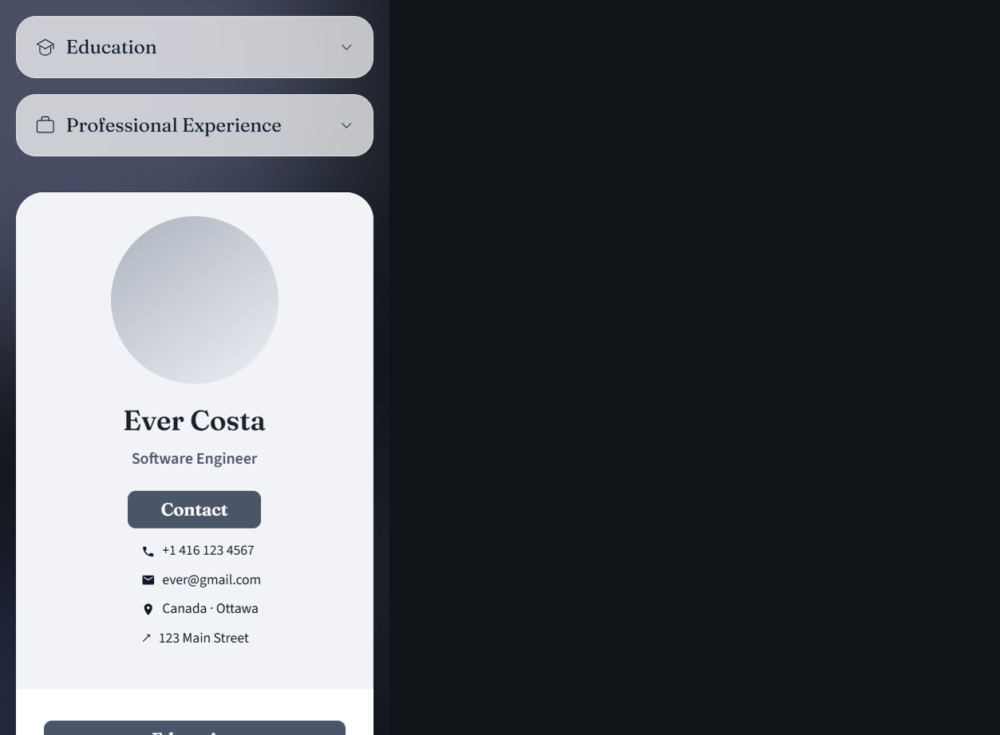

# Résumé — Interactive Resume Builder

A premium, real-time resume builder with live preview, theme personalization, and one-click PDF export. Built with React and Vite for a fast, accessible editing experience.

**[Live preview](https://resume-nu-lake.vercel.app/)**

## Demo


| Desktop (1440px) | Mobile (390px) |
| --- | --- |
|  |  |

## Features

- **Live preview** — Every field updates the resume instantly.
- **Six color palettes** — Curated light/accent pairs with cohesive editor theming.
- **Layout control** — Sidebar left or right on the resume preview.
- **Structured sections** — Personal info, education (up to 2 entries), and professional experience (up to 2 entries).
- **Sample / clear toggle** — Load demo content or reset to placeholders.
- **Focus mode** — Hide the preview for a distraction-free editing surface.
- **PDF export** — Download the preview as a print-ready PDF (lazy-loaded bundle).
- **Animated placeholders** — Guided typing hints on key fields (respects `prefers-reduced-motion`).
- **Sticky toolbar** — Personalization, sample toggle, download, and preview controls stay reachable while scrolling.

## Tech stack

| Layer | Technology |
| --- | --- |
| UI | React 18, CSS custom properties |
| Build | Vite 5 |
| PDF | html2canvas + jsPDF (code-split chunk) |
| Media tooling | Playwright / browser capture + ImageScript (GIF) |

## Getting started

### Prerequisites

- Node.js 18+
- npm 9+

### Install

```bash
git clone https://github.com/asdacosta/resume.git
cd resume
npm install
```

### Development

```bash
npm run dev
```

Open the URL shown in the terminal (default `http://localhost:5173`).

### Production build

```bash
npm run build
npm run preview
```

### Lint

```bash
npm run lint
```

### Regenerate README media

After UI changes, rebuild and capture fresh assets:

```bash
npm run build
npm run preview
# In another terminal:
npm run capture:media   # requires Playwright Chromium
node scripts/make-gif.mjs
```

Screenshots and `live.gif` are stored in `docs/media/`.

## Scripts

| Script | Description |
| --- | --- |
| `npm run dev` | Start Vite dev server with HMR |
| `npm run build` | Production build to `dist/` |
| `npm run preview` | Serve production build locally |
| `npm run lint` | ESLint for JS/JSX |
| `npm run capture:media` | Automated desktop/mobile screenshots (Playwright) |

## Project structure

```
resume/
├── docs/media/           # README screenshots and demo GIF
├── scripts/              # Media capture and GIF assembly
├── src/
│   ├── components/       # UI (editor, resume preview, toolbar, icons)
│   ├── context/          # ResumeProvider — shared app state
│   ├── data/             # Palettes and sample/empty templates
│   ├── hooks/            # Placeholder animation, reduced motion
│   ├── styles/           # Design tokens, global, and app CSS
│   └── utils/            # Formatters and PDF export
├── index.html
├── package.json
└── vite.config.js
```

## Architecture

The app uses a **single React context** (`ResumeProvider`) instead of imperative DOM scripts. State drives both the editor and preview; there is no `querySelector` coupling.

```
Toolbar / EditorPanel ──► ResumeContext ──► ResumePreview
                              │
                              ├── palette + layout
                              ├── personal / education / professional
                              └── visibility + sample mode
```

**PDF export** is dynamically imported so the main bundle stays smaller until the user downloads.

## Responsive behavior

| Breakpoint | Behavior |
| --- | --- |
| ≥ 1200px | Side-by-side editor and sticky preview |
| &lt; 1200px | Stacked layout; preview below editor |
| &lt; 720px | Single-column forms; compact toolbar |
| &lt; 480px | Reduced type scale and avatar size |

## Accessibility

- Semantic landmarks (`header`, `main`, `aside`, `section`)
- Visible `:focus-visible` outlines on interactive controls
- `aria-expanded`, `aria-pressed`, and descriptive `aria-label`s on toolbar actions
- Form labels tied to inputs with `htmlFor` / `id`
- `prefers-reduced-motion` disables placeholder animations
- Keyboard-operable buttons (no div-click handlers)

## Performance

- Vite production build with manual chunk for PDF dependencies
- Dynamic `import()` for PDF generation on download only
- CSS variables for theming (no per-keystroke style recalculation)
- Lightweight inline SVG icons (no icon font CDN)

## Deployment

The project is configured for static hosting (e.g. Vercel):

```bash
npm run build
```

Deploy the `dist/` folder. The live demo is hosted on Vercel.

## Origin

Inspired by [The Odin Project](https://www.theodinproject.com/) React curriculum — reimagined as a production-quality portfolio piece.

## Author

[Abraham Da Costa Silvanus](https://github.com/asdacosta)
